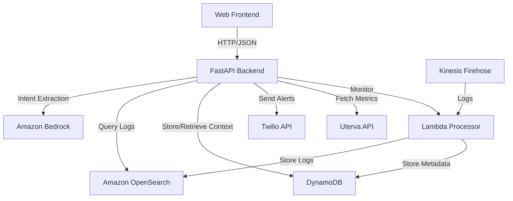
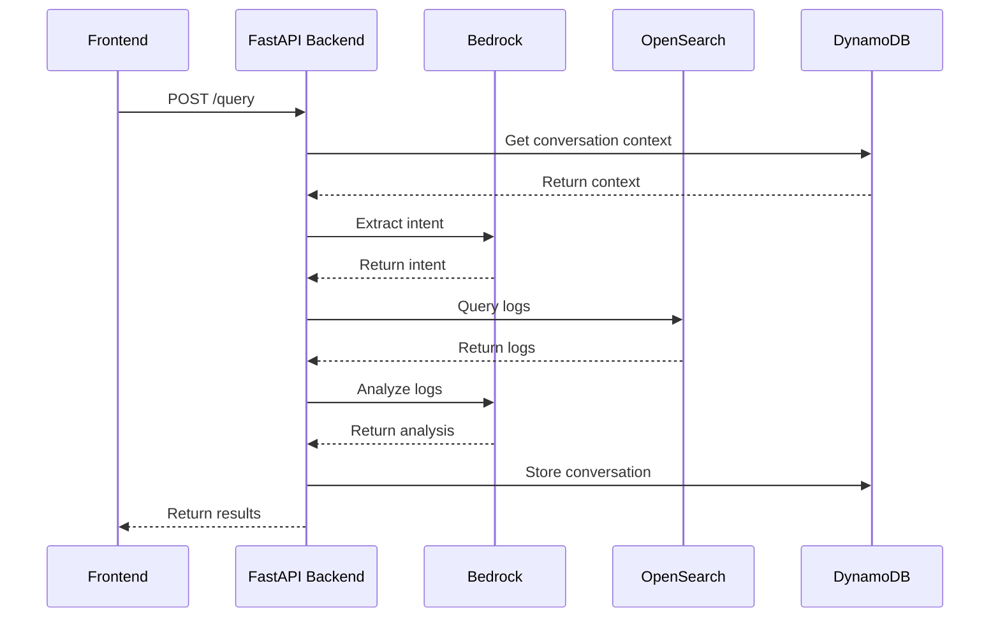
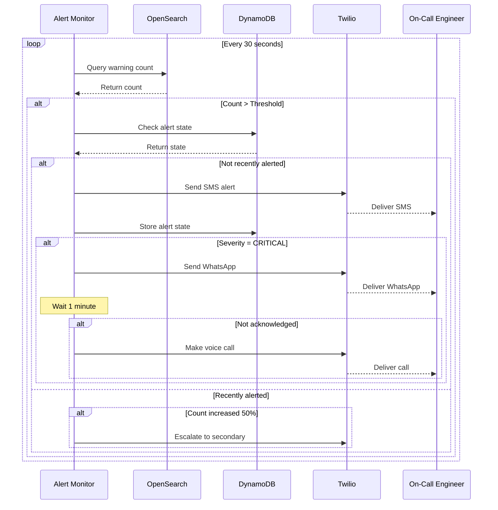

# Design Document: Backend Orchestration Service

## Overview

The Backend Orchestration Service is a FastAPI-based Python application that acts as the central coordination layer for the AI-Powered Debugging Platform. It connects the web frontend with AWS services (Amazon Bedrock, OpenSearch, DynamoDB, Kinesis) and external systems (Twilio, Uterva API) without modifying the existing architecture.

### Key Design Principles

1. **Orchestration-Only**: Does not replace existing components, only coordinates them
2. **Async-First**: Uses async/await for all I/O operations
3. **Modular Services**: Clear separation of concerns with service classes
4. **Stateless**: No in-memory state, all context stored in DynamoDB
5. **Resilient**: Circuit breakers, retries, and graceful degradation

### Technology Stack

- **Framework**: FastAPI (Python 3.11+)
- **AWS SDK**: boto3 with aioboto3 for async operations
- **HTTP Client**: httpx (async)
- **Data Validation**: Pydantic v2
- **Alert Integration**: Twilio SDK
- **Deployment**: AWS Lambda (with Lambda Web Adapter) or ECS Fargate

## Architecture

### High-Level Component Diagram



### Service Layer Architecture

The backend is organized into modular service classes:

1. **QueryService**: Handles query processing and orchestration
2. **BedrockService**: Manages Amazon Bedrock interactions
3. **OpenSearchService**: Handles log retrieval and search
4. **DynamoDBService**: Manages metadata and context storage
5. **AlertService**: Monitors thresholds and triggers alerts
6. **TwilioService**: Sends SMS/Voice/WhatsApp alerts
7. **UtervaService**: Integrates external bug metrics
8. **DashboardService**: Generates visualization-ready data

## API Endpoints

### Query Endpoints

#### POST /query
Submit a natural language debugging query.

**Request**:
```json
{
  "query": "Show errors in payment-service in the last hour",
  "user_id": "user-123",
  "conversation_id": "conv-456" // optional
}
```

**Response**:
```json
{
  "query_id": "query-789",
  "conversation_id": "conv-456",
  "intent": {
    "type": "error_analysis",
    "confidence": 0.95,
    "entities": {
      "service": "payment-service",
      "time_range": "1h",
      "severity": "ERROR"
    }
  },
  "results": {
    "logs": [...],
    "analysis": {
      "root_cause": "Database connection timeout",
      "confidence": 0.87,
      "evidence": ["log-id-1", "log-id-2"],
      "suggestions": [...]
    },
    "dashboard_data": {...}
  },
  "timestamp": "2024-01-15T10:30:00Z"
}
```

#### POST /query/followup
Submit a follow-up query with conversation context.

**Request**:
```json
{
  "query": "What about auth-service?",
  "conversation_id": "conv-456",
  "user_id": "user-123"
}
```

#### GET /conversation/{conversation_id}
Retrieve conversation history.

**Response**:
```json
{
  "conversation_id": "conv-456",
  "user_id": "user-123",
  "created_at": "2024-01-15T10:00:00Z",
  "messages": [
    {
      "role": "user",
      "content": "Show errors in payment-service",
      "timestamp": "2024-01-15T10:00:00Z"
    },
    {
      "role": "assistant",
      "content": "Found 45 errors...",
      "timestamp": "2024-01-15T10:00:03Z"
    }
  ]
}
```

### Health & Monitoring Endpoints

#### GET /health
Health check endpoint.

**Response**:
```json
{
  "status": "healthy",
  "services": {
    "bedrock": "up",
    "opensearch": "up",
    "dynamodb": "up",
    "twilio": "up"
  },
  "timestamp": "2024-01-15T10:30:00Z"
}
```

#### GET /metrics
Prometheus-format metrics.


## Data Models

### Query Request Model
```python
from pydantic import BaseModel, Field
from typing import Optional

class QueryRequest(BaseModel):
    query: str = Field(..., min_length=1, max_length=1000)
    user_id: str
    conversation_id: Optional[str] = None
```

### Intent Model
```python
class Intent(BaseModel):
    type: str  # log_search, error_analysis, timeline, root_cause
    confidence: float
    entities: dict
    time_range: Optional[dict] = None
    services: list[str] = []
    filters: dict = {}
    requires_visualization: bool = False
```

### Log Entry Model
```python
class LogEntry(BaseModel):
    id: str
    timestamp: str
    service: str
    severity: str
    message: str
    trace_id: Optional[str] = None
    transaction_id: Optional[str] = None
    metadata: dict = {}
```

### Analysis Result Model
```python
class AnalysisResult(BaseModel):
    root_cause: str
    confidence: float
    evidence: list[str]
    suggestions: list[dict]
    similar_incidents: list[str] = []
```

### Alert Model
```python
class Alert(BaseModel):
    alert_id: str
    service: str
    warning_count: int
    time_window: str
    severity: str
    suggested_action: str
    timestamp: str
```

## Service Components

### 1. QueryService

**Responsibilities**:
- Orchestrate end-to-end query processing
- Coordinate between Bedrock, OpenSearch, and DynamoDB
- Manage conversation context

**Key Methods**:
```python
class QueryService:
    async def process_query(self, query: QueryRequest) -> QueryResponse:
        # 1. Retrieve conversation context
        context = await self.dynamodb.get_conversation(query.conversation_id)
        
        # 2. Extract intent using Bedrock
        intent = await self.bedrock.extract_intent(query.query, context)
        
        # 3. Retrieve logs from OpenSearch
        logs = await self.opensearch.query_logs(intent)
        
        # 4. Analyze logs with Bedrock
        analysis = await self.bedrock.analyze_logs(logs, intent)
        
        # 5. Generate dashboard data
        dashboard_data = await self.dashboard.generate_data(logs, intent)
        
        # 6. Store conversation
        await self.dynamodb.store_conversation(query, intent, analysis)
        
        return QueryResponse(...)
```

### 2. BedrockService

**Responsibilities**:
- Interact with Amazon Bedrock API
- Extract intent from natural language
- Analyze logs and generate insights

**Key Methods**:
```python
class BedrockService:
    async def extract_intent(self, query: str, context: dict) -> Intent:
        prompt = self._build_intent_prompt(query, context)
        response = await self.bedrock_client.invoke_model(
            modelId="anthropic.claude-3-sonnet-20240229-v1:0",
            body=json.dumps({
                "anthropic_version": "bedrock-2023-05-31",
                "messages": [{"role": "user", "content": prompt}],
                "max_tokens": 1000
            })
        )
        return self._parse_intent(response)
    
    async def analyze_logs(self, logs: list[LogEntry], intent: Intent) -> AnalysisResult:
        prompt = self._build_analysis_prompt(logs, intent)
        response = await self.bedrock_client.invoke_model(...)
        return self._parse_analysis(response)
```

### 3. OpenSearchService

**Responsibilities**:
- Translate intent to OpenSearch queries
- Execute queries and retrieve logs
- Handle pagination and filtering

**Key Methods**:
```python
class OpenSearchService:
    async def query_logs(self, intent: Intent) -> list[LogEntry]:
        query = self._build_opensearch_query(intent)
        response = await self.opensearch_client.search(
            index="logs-*",
            body=query
        )
        return self._parse_logs(response)
    
    def _build_opensearch_query(self, intent: Intent) -> dict:
        query = {
            "query": {
                "bool": {
                    "must": [],
                    "filter": []
                }
            },
            "sort": [{"timestamp": "desc"}],
            "size": 1000
        }
        
        # Add service filter
        if intent.services:
            query["query"]["bool"]["filter"].append({
                "terms": {"service": intent.services}
            })
        
        # Add time range
        if intent.time_range:
            query["query"]["bool"]["filter"].append({
                "range": {"timestamp": intent.time_range}
            })
        
        # Add severity filter
        if "severity" in intent.filters:
            query["query"]["bool"]["filter"].append({
                "term": {"severity": intent.filters["severity"]}
            })
        
        return query
```

### 4. DynamoDBService

**Responsibilities**:
- Store and retrieve conversation context
- Store alert state
- Store incident metadata
- Query log metadata

**Key Methods**:
```python
class DynamoDBService:
    async def store_conversation(self, conversation_id: str, data: dict):
        await self.dynamodb_client.put_item(
            TableName="ConversationContext",
            Item={
                "conversation_id": conversation_id,
                "user_id": data["user_id"],
                "messages": data["messages"],
                "timestamp": int(time.time()),
                "ttl": int(time.time()) + 7776000  # 90 days
            }
        )
    
    async def get_conversation(self, conversation_id: str) -> dict:
        response = await self.dynamodb_client.get_item(
            TableName="ConversationContext",
            Key={"conversation_id": conversation_id}
        )
        return response.get("Item", {})
    
    async def query_by_trace_id(self, trace_id: str) -> list[dict]:
        response = await self.dynamodb_client.query(
            TableName="LogMetadata",
            IndexName="trace_id-timestamp-index",
            KeyConditionExpression="trace_id = :trace_id",
            ExpressionAttributeValues={":trace_id": trace_id}
        )
        return response.get("Items", [])
```

### 5. AlertService

**Responsibilities**:
- Monitor warning/error thresholds
- Detect anomalous spikes
- Trigger alert workflows
- Manage escalation

**Key Methods**:
```python
class AlertService:
    async def monitor_warnings(self):
        # Continuous monitoring loop
        while True:
            for service in self.monitored_services:
                count = await self._get_warning_count(service, window="5m")
                
                if count > self.thresholds[service]:
                    await self._trigger_alert(service, count)
            
            await asyncio.sleep(30)  # Check every 30 seconds
    
    async def _trigger_alert(self, service: str, count: int):
        # Check if already alerted
        alert_state = await self.dynamodb.get_alert_state(service)
        
        if alert_state and alert_state["alerted_at"] > time.time() - 300:
            # Already alerted in last 5 minutes, check for escalation
            if count > alert_state["previous_count"] * 1.5:
                await self._escalate_alert(service, count)
            return
        
        # Send new alert
        alert = Alert(
            alert_id=str(uuid.uuid4()),
            service=service,
            warning_count=count,
            time_window="5 minutes",
            severity="HIGH",
            suggested_action="Check service logs and recent deployments",
            timestamp=datetime.utcnow().isoformat()
        )
        
        await self.twilio.send_alert(alert)
        await self.dynamodb.store_alert_state(service, count)
```

### 6. TwilioService

**Responsibilities**:
- Send SMS alerts
- Send voice call alerts
- Send WhatsApp alerts

**Key Methods**:
```python
class TwilioService:
    async def send_alert(self, alert: Alert):
        # Send SMS
        await self._send_sms(alert)
        
        # Send WhatsApp if high severity
        if alert.severity == "CRITICAL":
            await self._send_whatsapp(alert)
        
        # Make voice call if critical and no acknowledgment
        if alert.severity == "CRITICAL":
            await asyncio.sleep(60)  # Wait 1 minute
            if not await self._is_acknowledged(alert.alert_id):
                await self._make_voice_call(alert)
    
    async def _send_sms(self, alert: Alert):
        message = f"""
        🚨 ALERT: {alert.service}
        
        Warning Count: {alert.warning_count}
        Time Window: {alert.time_window}
        Severity: {alert.severity}
        
        Action: {alert.suggested_action}
        
        Alert ID: {alert.alert_id}
        """
        
        await self.twilio_client.messages.create(
            to=self.on_call_number,
            from_=self.twilio_number,
            body=message
        )
```

### 7. DashboardService

**Responsibilities**:
- Analyze query results
- Generate visualization-ready data
- Suggest chart types

**Key Methods**:
```python
class DashboardService:
    async def generate_data(self, logs: list[LogEntry], intent: Intent) -> dict:
        if intent.type == "error_analysis":
            return await self._generate_error_dashboard(logs)
        elif intent.type == "timeline":
            return await self._generate_timeline_dashboard(logs)
        else:
            return await self._generate_generic_dashboard(logs)
    
    async def _generate_error_dashboard(self, logs: list[LogEntry]) -> dict:
        # Time series: error count over time
        time_series = self._aggregate_by_time(logs, interval="5m")
        
        # Distribution: errors by service
        service_dist = self._aggregate_by_field(logs, field="service")
        
        # Top errors
        top_errors = self._get_top_errors(logs, limit=10)
        
        return {
            "widgets": [
                {
                    "type": "timeseries",
                    "title": "Error Count Over Time",
                    "data": time_series
                },
                {
                    "type": "bar",
                    "title": "Errors by Service",
                    "data": service_dist
                },
                {
                    "type": "table",
                    "title": "Top Error Messages",
                    "data": top_errors
                }
            ]
        }
```

## Data Flow Diagrams

### Query Processing Flow



### Alert Workflow



## Configuration

### Environment Variables

```python
# AWS Configuration
AWS_REGION = "us-east-1"
AWS_ACCESS_KEY_ID = "..."
AWS_SECRET_ACCESS_KEY = "..."

# OpenSearch
OPENSEARCH_ENDPOINT = "https://..."
OPENSEARCH_USERNAME = "..."
OPENSEARCH_PASSWORD = "..."

# DynamoDB Tables
DYNAMODB_CONVERSATION_TABLE = "ConversationContext"
DYNAMODB_METADATA_TABLE = "LogMetadata"
DYNAMODB_ALERT_TABLE = "AlertState"

# Twilio
TWILIO_ACCOUNT_SID = "..."
TWILIO_AUTH_TOKEN = "..."
TWILIO_PHONE_NUMBER = "+1..."
ONCALL_PHONE_NUMBER = "+1..."
ONCALL_WHATSAPP_NUMBER = "whatsapp:+1..."

# Uterva API
UTERVA_API_KEY = "..."
UTERVA_API_ENDPOINT = "https://..."

# Alert Thresholds
ALERT_THRESHOLD_PAYMENT_SERVICE = 100
ALERT_THRESHOLD_AUTH_SERVICE = 50
ALERT_WINDOW_SECONDS = 300

# Rate Limiting
RATE_LIMIT_PER_MINUTE = 100
```

## Error Handling

### Retry Strategy
```python
from tenacity import retry, stop_after_attempt, wait_exponential

class BedrockService:
    @retry(
        stop=stop_after_attempt(3),
        wait=wait_exponential(multiplier=1, min=1, max=10)
    )
    async def extract_intent(self, query: str, context: dict) -> Intent:
        # Implementation
        pass
```

### Circuit Breaker
```python
from circuitbreaker import circuit

class OpenSearchService:
    @circuit(failure_threshold=5, recovery_timeout=60)
    async def query_logs(self, intent: Intent) -> list[LogEntry]:
        # Implementation
        pass
```

### Graceful Degradation
```python
async def process_query(self, query: QueryRequest) -> QueryResponse:
    try:
        # Try full AI analysis
        analysis = await self.bedrock.analyze_logs(logs, intent)
    except BedrockUnavailableError:
        # Fallback to basic analysis
        analysis = self._basic_analysis(logs)
    
    return QueryResponse(...)
```

## Deployment

### AWS Lambda Deployment
```yaml
# serverless.yml
service: backend-orchestration

provider:
  name: aws
  runtime: python3.11
  region: us-east-1
  environment:
    AWS_REGION: ${env:AWS_REGION}
    OPENSEARCH_ENDPOINT: ${env:OPENSEARCH_ENDPOINT}
    # ... other env vars

functions:
  api:
    handler: main.handler
    timeout: 30
    memorySize: 1024
    events:
      - httpApi: '*'
```

### Docker Deployment (ECS)
```dockerfile
FROM python:3.11-slim

WORKDIR /app

COPY requirements.txt .
RUN pip install --no-cache-dir -r requirements.txt

COPY . .

CMD ["uvicorn", "main:app", "--host", "0.0.0.0", "--port", "8000"]
```

## Testing Strategy

### Unit Tests
- Test each service class independently
- Mock external dependencies (Bedrock, OpenSearch, DynamoDB)
- Test error handling and retries

### Integration Tests
- Test end-to-end query flow
- Test alert workflow
- Use LocalStack for AWS services

### Load Tests
- Simulate 100 concurrent requests
- Measure response times
- Verify rate limiting

## Monitoring & Observability

### Metrics to Track
- Query response time (P50, P95, P99)
- Bedrock API call count and latency
- OpenSearch query latency
- Alert delivery success rate
- Error rate by endpoint

### Logging
```python
import structlog

logger = structlog.get_logger()

async def process_query(self, query: QueryRequest) -> QueryResponse:
    logger.info(
        "query_received",
        query_id=query_id,
        user_id=query.user_id,
        query_length=len(query.query)
    )
    # ... processing
    logger.info(
        "query_completed",
        query_id=query_id,
        duration_ms=duration,
        log_count=len(logs)
    )
```

## Security Considerations

### API Authentication
```python
from fastapi import Depends, HTTPException
from fastapi.security import HTTPBearer

security = HTTPBearer()

async def verify_token(credentials: HTTPAuthorizationCredentials = Depends(security)):
    token = credentials.credentials
    # Verify JWT token with Cognito
    if not await verify_jwt(token):
        raise HTTPException(status_code=401, detail="Invalid token")
    return token
```

### Rate Limiting
```python
from slowapi import Limiter
from slowapi.util import get_remote_address

limiter = Limiter(key_func=get_remote_address)

@app.post("/query")
@limiter.limit("100/minute")
async def query_endpoint(request: Request, query: QueryRequest):
    # Implementation
    pass
```

### Input Validation
```python
class QueryRequest(BaseModel):
    query: str = Field(..., min_length=1, max_length=1000, pattern="^[a-zA-Z0-9 .,?!-]+$")
    user_id: str = Field(..., pattern="^user-[a-zA-Z0-9]+$")
```

## Future Enhancements

1. **WebSocket Support**: Real-time streaming of query results
2. **Caching Layer**: Redis for frequently accessed data
3. **Advanced ML**: Custom models for anomaly detection
4. **Multi-Region**: Deploy in multiple AWS regions
5. **GraphQL API**: Alternative to REST for complex queries
6. **Batch Processing**: Support for bulk query analysis
