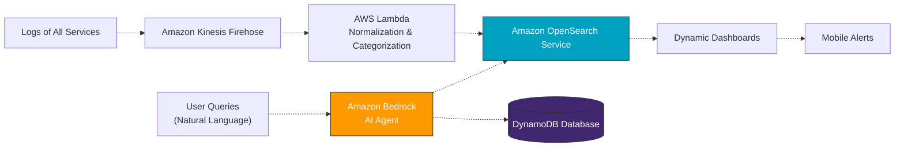

# Design Document: AI-Powered Debugging Platform

## Overview

The AI-Powered Debugging Platform is a web-based observability portal that simplifies debugging of distributed systems through conversational AI. It eliminates the need for query languages and manual dashboard configuration by providing a natural language interface powered by Amazon Bedrock and Amazon Q.

### Key Design Principles

1. Intent-driven behavior based on user queries  
2. Natural language interaction without query syntax  
3. Automatic dashboard generation  
4. Context-aware correlation across services  
5. Unified interface for chat, dashboards, and history  

### Technology Stack

- **Frontend:** React with TypeScript (AWS Amplify)  
- **Backend API:** Flask on AWS Lambda via API Gateway  
- **AI Services:** Amazon Bedrock 
- **Log Ingestion:** Amazon Kinesis Firehose  
- **Processing:** AWS Lambda  
- **Storage:** Amazon OpenSearch Service, DynamoDB  

---

## Architecture Diagram

### High-Level Architecture

User → Web Interface → API Gateway → Backend Lambda → AI Services → Log Stores  

Microservices → Kinesis Firehose → Processing Lambda → OpenSearch + DynamoDB  

### Component Architecture

The platform consists of five main subsystems:

1. Web Frontend  
2. API Layer  
3. AI Orchestration Layer  
4. Log Analysis Engine  
5. Dashboard Generation Engine  

---

## Data Flow

### Query Processing Flow

User Query → Frontend → API Gateway → Intent Extraction → Log Retrieval → AI Analysis → Dashboard Generation → Response Display  

### Log Ingestion Flow

Service Logs → Kinesis Firehose → Lambda Processing → Normalization → OpenSearch (logs) + DynamoDB (metadata)  

---

## Components and Interfaces

### 1. Web Frontend

#### Chatbot Interface

**Responsibilities**

- Conversational UI  
- Query submission  
- Display formatted AI responses  
- Maintain conversation context  

#### Dashboard Visualization

**Responsibilities**

- Render dynamically generated dashboards  
- Support multiple chart types  
- Interactive filtering and drill-down  

#### History and Navigation

**Responsibilities**

- Query history display  
- Saved dashboards  
- Navigation to past investigations  

---

### 2. Backend API Layer

#### Query Handler Service

**Responsibilities**

- Validate incoming queries  
- Extract intent using Amazon Bedrock  
- Manage conversation context  
- Route processing pipeline  

#### AI Orchestration Service

**Responsibilities**

- Coordinate Amazon Bedrock and Amazon Q  
- Construct prompts for debugging context  
- Handle service failures and fallbacks  

#### Log Query Service

**Responsibilities**

- Translate intent into OpenSearch queries  
- Execute optimized searches  
- Correlate logs across services  

---

### 3. Dashboard Generation Engine

**Responsibilities**

- Determine optimal visualization types  
- Generate dashboards dynamically  
- Cache generated dashboards  

Supported dashboard types include error analysis, performance metrics, comparisons, and timelines.

---

### 4. Log Processing Pipeline

**Responsibilities**

- Ingest logs from Kinesis Firehose  
- Normalize heterogeneous formats  
- Extract and enrich metadata  
- Store logs in OpenSearch and DynamoDB  

---

### 5. Incident Intelligence Service

**Responsibilities**

- Detect incident patterns  
- Construct incident timelines  
- Identify root causes  
- Track incident history  

---

## Summary

The platform delivers an intent-driven debugging experience by combining scalable log ingestion, AI-powered analysis, and autonomous visualization into a unified cloud-native system.

